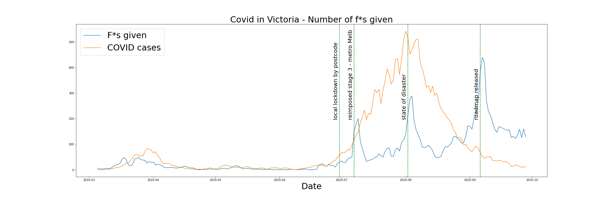

# covid_fs
Life has been hard. Covid is hard. As a Melbournian, I feel it with the recent lockdown.

So what better way to spend my time than to plot the number of F***s given during these covid times.

This notebook is just a simple project to scrape the (melbourne subreddit's)[https://reddit.com/r/melbourne] daily coronavirus megathreads' comments, and plot the number of times the F-word has been uttered against the number of cases we have had in Victoria, Australia.

Against a few spikes coinciding with key covid events, there is a general trend of increasingly swear-y melbournians as covid drags on. :(

  
   
* values are 3-day rolling averages

